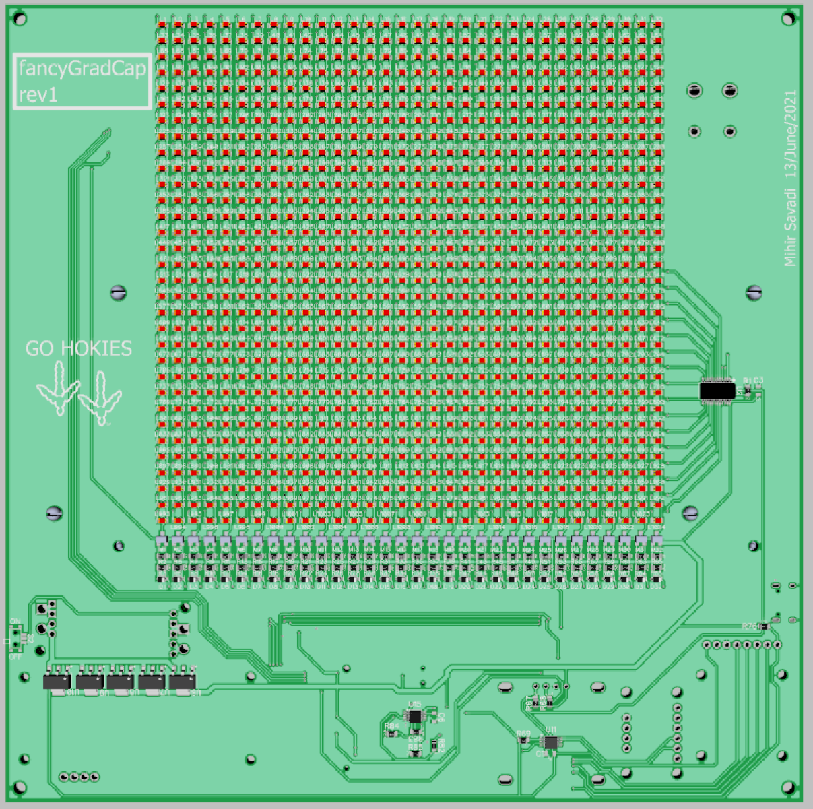
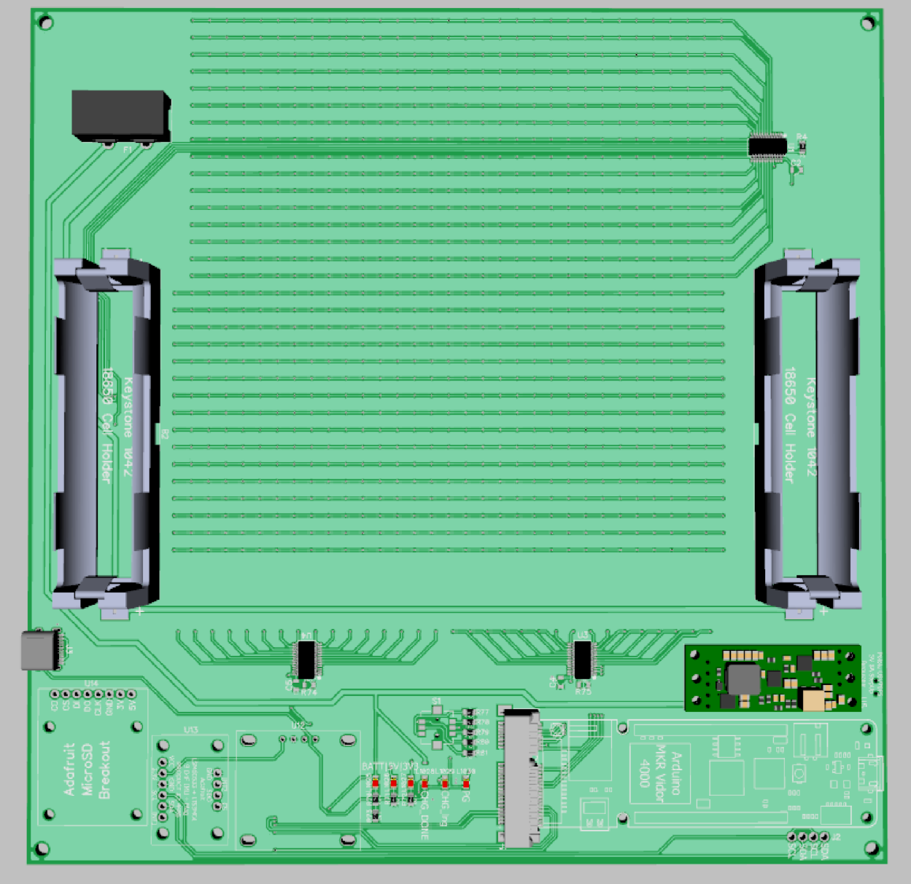
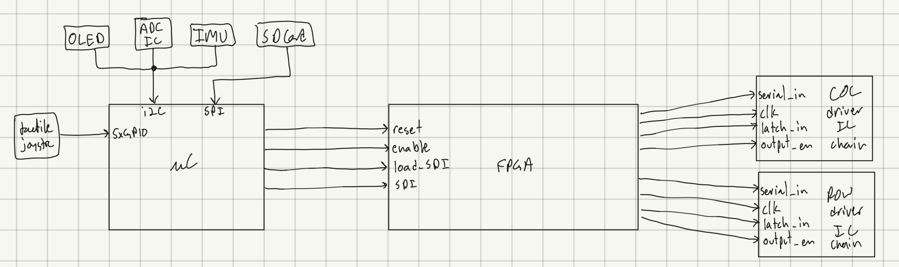
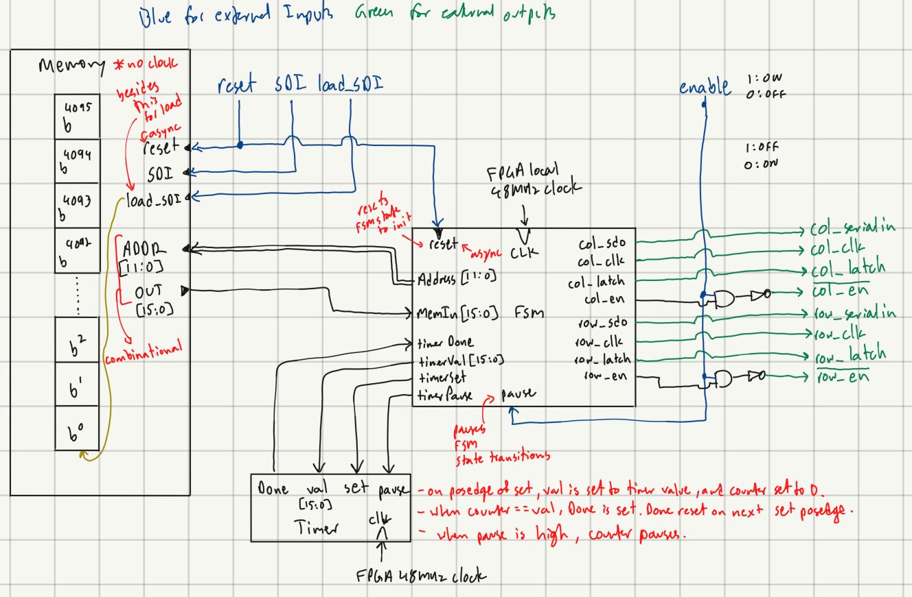
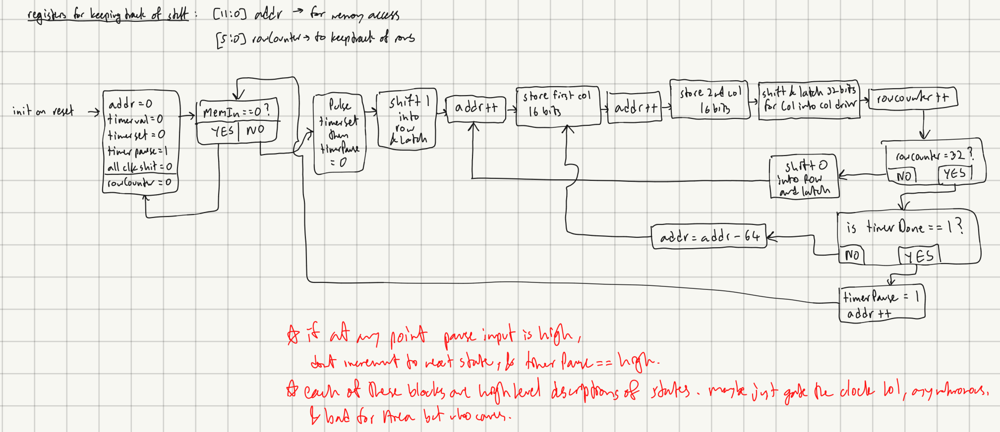

# fancyGradHat

  

**Project Status: Hardware not yet in hand. High level architecture, schematics, and PCB design sorted. RTL being written.**

Undergraduates in the US typically wear a mortarboard (or square academic cap, graduate cap, oxford cap etc...its the one with the tassel dangling off it) during their graduation. My turn to wear one would be around May 2022. At Virginia Tech people typically decorate their hats depending on significant things they did in college or other messages or jokes they might want to display. I wanted to embed a discrete LED matrix under the hat's fabric that could display anything at will.

This has been done many times in the past by people from all over. What makes this project different however is that the entire system is on a single PCB, with no off-the-shelf LED panels or other controls systems being used. The entire 'stack' - from media input and formatting to LED matrix control hardware - is built from the ground up. I use 1024 individual 0805 LED's, which are commodity parts, arranged in a 32x32 grid. These are then driven by four [STMicroelectronic's STP16CPC26PTR LED Display Driver IC's](https://www.mouser.com/ProductDetail/STMicroelectronics/STP16CPC26PTR?qs=GkDVaEP5dcsHBCBm3pftPw%3D%3D). The FGPA in the [Arduino MKR VIDOR 4000](https://store.arduino.cc/usa/mkr-vidor-4000) runs custom RTL (register transfer level) defined 'hardware' that is used to drive these IC's, as well as interface with a Microcontroller (also present in the Arduino MKR VIDOR 4000) that handles user interfacing, data storage, and other peripherals. Details about the entire architecture can be found further below. The goal is to have a very thin, lightweight, independent, and power efficient system that can slip in between the mortarboard and top-fabric of a typical square 9.5"x9.5" graduation cap. The Arduino MKR VIDOR 4000 - the brains of the system - lends to these goals excellently, with tight integration of a multitude of features (including WiFi and Bluetooth connectivity) all of which are easy to use. Its Mini PCIE connector is especially exploited in this project.

Below are screenshots of the renderings of the PCB. To explore the hardware further see schematics, BOM, etc at [./pcb_files/fancyGradCap_rev1/](./pcb_files/fancyGradCap_rev1/).

    
    

Going this route has a lot of tradeoffs - a lot more complexity; monochromic media only; relatively low resolution. But, given the low prices of PCB fabrication and assembly services from jlcpcb.com and pcbway.com, and the use of mostly commodity parts, this approach is relatively cheaper. Also, because of the use of the FPGA, the entire signal processing architecture is extremely flexible, and the microcontroller is free to do a whole host of other tasks - all of which allow a huge margin for feature-expandability with no change in hardware. Finally, despite the significant extra complexity, I much prefer (and enjoy) the freedom of implementation and control that comes with this approach, as opposed to having to spend unreasonable amounts of time energy and patience rummaging through opaque documentation of some one particular DSP microcontroller. I'm also fairly comfortable with digital design, and I have a year until I graduate. I don't anticipate this to be too painful. We'll see.

An example of a really cool project by Nathan Peterson that closely paralleled this one can be found here - [https://nathanpetersen.com/2018/11/11/gradled-mini-prototype-modular-discrete-led-display/](https://nathanpetersen.com/2018/11/11/gradled-mini-prototype-modular-discrete-led-display/).

## Quick Notes on Various Things

- One of the most critical parts of this build - the STP16CPC26PTR LED driver by STMicroelectronics - went from being in stock (in the 1000's) from all major distributors, to virtually extinct in the matter of a few weeks, and I had no idea! Restock estimates were for mid to late 2022, despite STMicro's website labelling the IC as active. I had to nab the last 10 that was in stock at newark.com, a distributer which I've never used, in order to make sure Im not screwed or have to make major redesigns. This is a great lesson in semi-conductor sourcing. In all fairness the IC is quite old and serves a niche market with its bare bones parallel-ish serial interface. Its a shame that most newer equivalent IC's work with i2c or SPI which is a greater pain to set up and has lass fine grain control - the advantage obviously is industry standardization and the lack of need for such fine grain control. The embedded world is not friendly to FPGA/custom hardware designers!

## System Architecture

### Microcontroller, Peripherals and User Interfacing

Below is a block diagram of the high-level connections between the microcontroller, FPGA, and Row and Column LED Display Driver ICs. Apologies for the bad hand-writing.

    

So the brains of the project is the [Arduino MKR VIDOR 4000](https://store.arduino.cc/usa/mkr-vidor-4000). Of its many features, we use its microcontroller, FPGA, Wifi/Bluetooth module, and mini PCIE connector. External peripherals I included in the PCB are an ADC (analog to digital converter), IMU (inertial measurement unit), 0.96" OLED display, SD Card reader, and 5-way tactile switch. The ADC allows for sampling of the 18650 Lithium Ion cell's voltage that power the board (for state of charge information), which is not compatible with the 3.3V VSS of the Arduino MKR VIDOR 4000 (which is why we did not use its onboard ADC's instead). The IMU is just there for potential feature expansions. The OLED is to allow for easier and more flexible user interfacing and display of various information, in conjunction with the 5-way tactile switch. The ADC, IMU, and OLED display operate on an i2c bus. The SD card reader is for holding an SD card that will store various user-selectable and LED-matrix-displayable media. The Arduino MKR VIDOR 4000 is really nice because all of the microcontroller's outputs are wired in parallel to specific FPGA GPIO's as well as mini PCIE connector pins. Thus, within the FPGA we can connect whatever GPIO's we want whilst exploiting the robustness and high-density of the PCIE connector.

When the user prompts it, the microcontroller will signal and feed the appropriate data into the fpga, which will then constantly run the LED matrix independently, opening up tons of 'room' for the microcontroller to quickly and efficiently run its other tasks. This is especially important since driving a display of any sort, especially for animation, requires tight timing consistency. Maintaining this timing consistency becomes very complicated and taxing in a single threaded microcontroller where psuedo-concurrency would have to be implemented via interrupts or an RTOS (real time operating system). Just designing dedicated hardware and having complete control across the abstraction ladder simplifies this and makes it all less painful...in my opinion...many people may disagree.

### How Data is Standardized and Handled

There are 32x32 LED's in the matrix, totalling 1024 LED's, or pixels. The matrix is driven row by row, one row at a time, extremely quickly. This exploits the "Persistence of Vision" effect which allows us to perceive one unmoving image. The reason we do this is because we have a limited amount of GPIO's and wire routing space to drive all of the 1024 LED's independently and simultaneously.

Each 'frame' - i.e. a still image - sees each pixel as being either ON or OFF, and can therefore be represented as either a 0 or 1. Hence, the data describing each frame can be represented with a single 1024bit word. We will standardize this encoding with the LSB (least significant bit) representing the pixel at the top left hand corner, with each subsequent bit representing subsequent pixels in a 'left-to-right' 'top-to-bottom' order.

Animations are divided into a series of frames. Each frame in an animation contains the 1024bit word representing the data that makes up that frame, but also 16bits that prepends the aforementioned 1024bits. This 16bit word represents the time in milliseconds that this frame must be displayed for before moving on to the next frame - we'll call it the 'hold time'. Hence each frame, whether it is a lone still image or part of an animation, requires 1040bits of data. If this 16bit 'hold time' is 0, then the system will interpret this such that it will not display the information represented in the following 1024 bits; instead will loop back to the first frame in the set of memory holding the entire animation. For lone still images, the hold time is set to the maximum 2^16 = 65535 value, so as to reduce needlessly having to traverse longer 'decision and event paths' in the Finite State Machine that governs all the control logic, thereby saving power.

Animations and still frames will be stored in text-files. The first line will contain a number from 0 to 65535, which will represent the amount of time in milliseconds that the associated frame will be displayed on the LED matrix. If the intention is for the file to depict a single still frame and not an animation, then this number will be 65535 as previously described. Then on the next line will be a 32x32 grid of '#' and '\`' characters, where a '#' will a represent 1 and a '\`' will represent a 0. This will mirror exactly the image to be displayed on the 32x32 LED matrix, except in an ASCII friendly fashion - allowing a baked-in and portable 'preview' to the user of what their text-file program is going to display on the fancyGradHat. If an animation is to be displayed then this pattern of number-between-0-and-65535 followed by 32x32-grid-of-'#'-and-'`' will continue until the final frame. After the final frame there must either be a 0 or no more characters. With these rules in mind, the microcontroller can then fetch these individual text files from the SD card, decode them into a bit stream (where the number of total bits representing the image or animation will be a multiple of 1040 bits), and feed them into the FPGA. If any of these rules are disobeyed, the microcontroller will throw an error - either on the 0.96" OLED or via some other form of user interfacing.

In order to create these text files I also plan to make some sort of software interpreter that would run on a pc or mobile phone, that can offer a canvas for a user to draw on, or offer a user the option to upload an image, from which it would create an appropriate text file that the user can then preview and load into the fancyGradHat. In the case of the mobile phone, the Arduino MKR VIDOR 4000's wifi/bluetooth capabilities could be used to allow for over-the-air commands and text-file uploads as well.

The microcontroller will deliver the data in this text-files by encoding the entire text-file into one continuous bit-stream, with the total number of bits being some non-zero multiple of 1040 depending on the number of frames present. As can be seen in [the overall block diagram above](./pics_vids_figures/blockdiagoverall.png), this bitstream is delivered via the single 'SDI' (serial data-in) port in the FPGA. On every positive edge delivered into the 'load_SDI' port, the data will be stored bit by bit in a FIFO (first-in-first-out) style 16bit word-size 12bit address-space memory in the FPGA (detailed in the next section). The enable port, which is asynchronous, will disable all LED outputs when held low, and pause any animations. The reset port will reset all memory in the FPGA to 0's, as well as the Finite State Machine in the FPGA.

When a user selects a new image via the OLED/5-way-switch interface, the microcontroller will first hold the enable port low, then deliver a square pulse to the reset port, then load all 1040*n bits via the SDI and load_SDI ports (where n is the number of frames), then release the enable port back to a high logic state.

### The stuff that lives in the FPGA

Below is a block diagram of the RTL living in the FPGA. Once again, apologies for the bad handwriting.

    

Starting with the block on the left, we have the ROM that is interfaced with via the reset, SDI, and load_SDI we spoke about in the previous section. It is a 12-bit addressed 16-bit word-size memory block. Since each frame requires 1040bits, each frame would need to take up 65 words (2 words per matrix row). Because of our 12-bit address space, we can contain 2^12 = 4096 words, which roughly equals 63.0154 equivalent frames. The remaining '0.0154' equates to 1 wasted word of memory, which is not bad at all - the numbers fit nicely! This can easily be scaled up or down depending on remaining FPGA resources. Alternatively you could also use an external flash memory chip (which the Arduino MKR VIDOR 4000 has), but this adds more complexity that I do not feel like dealing with at the moment.

On every positive edge of the 'load_SDI' input, the value (1 or 0) sitting at the 'SDI' input is loaded into the ROM/memory. It is loaded from LSB (least significant byte) to MSB (most significant byte), from the 0th address up. On a positive edge on reset, all memory addresses are reset to 0. Memory access from the FSM (finite state) is done via a combinational 'ADDR' (i.e. address) port and 'OUT' (i.e. output) port, where by the 'OUT' port, which is 16-bits wide, will "immediately" deliver the data sitting in the address that appears on the 'ADDR' input port, which is 12-bits wide.

Moving on the next block is the timer block shown in the bottom left. On every positive edge of its 'set' input port, the value on its 'val' input port (which is 16 bits wide) will be what the Timer sets as its timer value, and its internal counter will reset to 0. Remember that this value is in units of milliseconds. When the timer reaches its timer value, its 'Done' output port is set to high. The 'Done' output port will only be reset back to low on the following positive edge of the 'set' input port. When the 'pause' input is high, the counter pauses, and when it is low the counter carries on as usual. The timer is used by the FSM to control how long to keep a certain frame displayed for.

Now below is a high-level flow chart of the logic path that the FSM will use to control its various inputs and outputs in order to drive the LED Display Driver IC's appropriately. I apologize for the bad hand-writing again. The flow chart is self descriptive and compartmentalizes a lot of information that would other wise be very impractical and ineffective to describe in prose - it is recommended to have both [the fpga block diagram](./pics_vids_figures/fpgablockdiagram.png) and the flow chart below in view when studying the FSM flow.

<image of block diagram>

    

Note that each of the blocks in the flow chart are high level descriptions of event sequences that in reality would break down into further series' of chronological states in the RTL. If the FSM's 'pause' input is high at any point, there will be no transition into a proceeding high-level flow chart block until the 'pause' input is drawn back low again.

Also note that the STP16CPC26PTR LED Display Driver IC's have a maximum clock frequency of 30Mhz - attention will have to paid to this during implementation of the FSM which is driven by the Arduino MKR VIDOR 4000's on-board 48Mhz clock.

It should be noted that the STP16CPC26PTR LED Display Driver IC's also do not have a dedicated reset port or functionality. So, on every positive edge received on the reset input of the FSM, in addition to resetting it's state, the FSM will also have to load the LED Display Driver IC's with 32-bits of 0's in order to effectively 'clear' the its memory.

One cool thing about this entire system is that you could theoretically achieve around 30,000-ish frames per second of animation speed. However because of the 16bit millisecond hold-time parameter as part of my data format standardization, the maximum frame rate would be exactly 1000 frames per second. This is still insane, and unlikely to be fully exploited with the current 63 frame memory ceiling. But, as described earlier, the memory size/address space can be scaled up later depending on remaining FPGA resources in order to take advantage of this high frame rate.  
