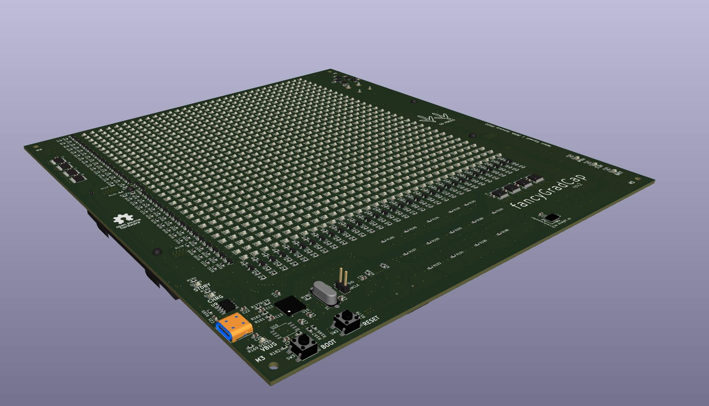

improvements:
    - using commodity SN74HCS596PWR shift register instead of expensive and rare STP16CPC26PTR.
    - 4 layer for better EMI
    - high and low side fets for led matrix.
    - single rp2040 - go into this.
    - buttons only, simpler.
    - dynamic (based on real time data like voltage and IMU) and static images (from memory)
    - all circuitry integrated no breakout boards
    - used KiCAD instead of diptrace, a lot better in terms of design automation and scalability/maintainability.

See images of 'rev2_*.jpg' in ./pics_vids_figures if images below are not rendering (possibly because of bad links).

